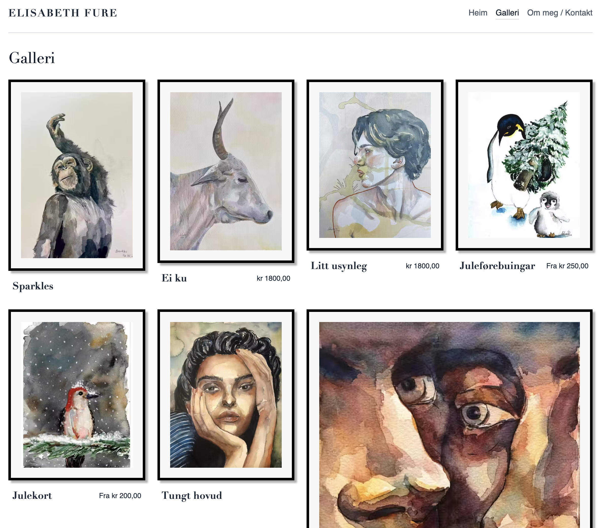

<link rel="stylesheet" href="https://cdn.jsdelivr.net/gh/devicons/devicon@latest/devicon.min.css">

<h1> Hi there!</h1>

<h2>Sindre Sauarlia here  👋🏼 </h2>

 

I'm a Norwegian student pursuing a Bachelor's degree in IT at Oslo Metropolitan University. My ultimate goal is to become a full-stack software developer with a strong focus on understanding the broader context of the project I am working on. 

When I'm not writing code, I work as a performing musician playing keyboard instruments or teaching kids how to play the piano.

I believe in the power of collaboration and continuous learning and welcome the chance to work on interesting projects. Feel free to check out my projects here on GitHub and let's connect!

  
  

<h2> 🛠 Preferred Programming Languages : </h2>

<h2> 🛠 Preferred Frameworks and Technologies : </h2>

<!-- Hugging Face logo might need to be sourced separately -->

<h2> 🔥 My Stats</h2>

  
  

<h2>👷🏼‍♂️ Projects I'm Currently Working On</h2>
  

    

    
    

    <h3>Furekunst</h3>
    
An Astro-powered portfolio website for an artist, featuring a clean design and easy content management.

    

        <a href="https://furekunst.no/" target="_blank">Visit Furekunst</a>
        <a href="https://github.com/SindreSau/furekunst" target="_blank">View Source Code</a>
    

    

    
    

    <h3>Bogstad Gård Smie</h3>
    
A modern Astro website for a blacksmith business, showcasing their work and services with a user-friendly interface.

    

        <a href="https://www.bogstadsmie.no" target="_blank">Visit Bogstad Gård Smie</a>
        <a href="https://github.com/SindreSau/Smithy-blog" target="_blank">View Source Code</a>
    

<!-- Medlytic -->

  <h3 style="margin: 0; text-align: center;">Medlytic</h3>
  

    Streamlining data collection, analysis, and visualization for a healthcare startup. Building a dashboard for visualisation and python microservices for generating AI descriptions and HTML ➡️ PDF generation.
  

  

    Python |
    FastAPI |
    Laravel |
    Vue.js
  

